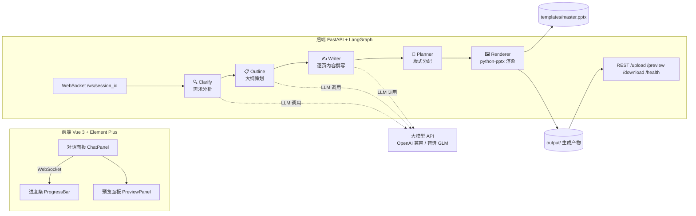

# 🎨 GenPPT Agent

> 基于 **FastAPI + LangGraph + LangChain** 的多智能体 PPT 生成系统，配套 **Vue 3** 前端。
> 只需一句话需求，Agent 自动完成 **需求分析 → 大纲策划 → 内容撰写 → 版式规划 → PPT 渲染** 全流程，实时流式展示每个阶段的分析结果，最终产出可直接下载的 `.pptx`（并支持在线 PDF 预览）。


---

## ✨ 功能特性

- 🤖 **多智能体流水线**：LangGraph 编排 5 个节点（Clarify / Outline / Writer / Planner / Renderer），支持条件路由与人工确认
- 💬 **对话式生成**：信息不足时反问补充，大纲可反复修改，回复"确认"后才开始生成
- 📡 **全阶段实时可视**：WebSocket 流式推送各阶段结构化结果 —— 🔍 需求分析、📋 大纲预览、✍️ 每页要点与演讲备注、🎨 版式分配、🧩 模板套用信息，配进度条平滑推进
- 📐 **真实模板驱动**：复用 `templates/master.pptx` 的封面 / 目录 / 致谢页设计（自动填入标题、目录条目、汇报日期），正文使用模板母版版式；目录条目超出模板容量时自动**克隆条目框 + 等距重排 + 缩放字号**，字体颜色始终跟随模板
- 📊 **智能版式分配**：根据每页内容量与是否含图表，自动匹配「标题和内容 / 两栏内容 / 仅标题」等模板版式（支持中英文版式名别名兜底）
- 🎤 **演讲备注**：每页自动生成 notes，可在 PowerPoint 演示者视图直接使用
- 📄 **上传素材**：支持随需求附加文件（图片等），Agent 上下文中引用
- 🖥️ **在线预览**：后端内置 LibreOffice，`.pptx → .pdf` 转换后右侧即时预览，也可下载源文件

## 🏗️ 系统架构



**阶段推进与消息类型**（WS 双向）：

| 阶段 | 发送的事件 | 说明 |
|---|---|---|
| CLARIFY | `progress` `analysis` | 需求分析（主题/受众/页数/风格/素材），信息不足则反问 |
| OUTLINE | `progress` `outline` | 大纲（主题风格 + 逐页标题），可修改后确认 |
| DRAFT | `progress` `draft` | 每页内容：要点 bullets、演讲备注、图表数据（逐页推送） |
| RENDER | `progress` `layout` `template` | 版式分配结果、模板套用信息、渲染进度 |
| DONE | `result` | 完成文案 + `file_ready`，随后可调 `/preview`、`/download` |

## 🛠️ 技术栈

| 层 | 技术 |
|---|---|
| 后端框架 | FastAPI · Uvicorn · WebSockets |
| Agent 编排 | LangGraph · LangChain · LangChain-OpenAI（OpenAI 兼容接口，可接智谱/GLM、OpenAI、DeepSeek 等） |
| 文档生成 | python-pptx（模板解析、版式分配、notes 写入） |
| 在线预览 | LibreOffice（容器内，pptx → pdf） |
| 前端 | Vue 3 · Vite · Element Plus · Tailwind CSS |
| 部署 | Docker Compose（backend:8000 + frontend/nginx:80） |

## 🚀 快速开始

### 环境要求

- [Docker Desktop](https://www.docker.com/products/docker-desktop/)（Windows / macOS / Linux）
- （可选，本地开发模式才需要）Python 3.11+、Node.js 18+、Git

### 1️⃣ 获取项目

```bash
git clone https://github.com/YRZ-o/GenPPTAgent-main.git
cd GenPPTAgent
```

### 2️⃣ 配置环境变量

项目根目录新建 `.env`（仓库自带示例结构，**该文件已在 `.gitignore` 中，不会被提交**）：

```dotenv
# ===== 必填：大模型 API =====
OPENAI_API_KEY=sk-xxxxxxxxxxxxxxxx

# ===== 可选：兼容 API 的接入地址（用 OpenAI 官方可删除此行）=====
OPENAI_BASE_URL=https://open.bigmodel.cn/api/paas/v4

# ===== 可选：模型名，默认 gpt-4o =====
OPENAI_MODEL=glm-4-flash

# ===== 前端 WebSocket 地址（部署到服务器时改为 wss://your-domain）=====
VITE_WS_URL=ws://localhost:8000
```

**配置项说明：**

| 变量 | 必填 | 默认值 | 说明 |
|---|---|---|---|
| `OPENAI_API_KEY` | ✅ | — | 任意 OpenAI 兼容接口的 Key（智谱、OpenAI、DeepSeek、Moonshot…） |
| `OPENAI_BASE_URL` | ⬜ | `https://api.openai.com/v1` | 兼容接口 Base URL |
| `OPENAI_MODEL` | ⬜ | `gpt-4o` | 模型名。智谱免费档推荐 `glm-4-flash`（`glm-4.5-flash` 亦可）；`glm-5.3-flash`/`glm-4-plus` 等付费模型在**无余额的 key** 上会返回 `429 code 1113` |
| `VITE_WS_URL` | ⬜ | `ws://localhost:8000` | 浏览器直连后端的 WS 地址；走 nginx 同源代理时用于构建期注入 |
| `PPT_TEMPLATE` | ⬜ | `master.pptx` | 指定 `backend/templates/` 下的模板文件名（也可直接只放一个 `.pptx` 自动识别） |

### 3️⃣ 一键启动（推荐 Docker）

```bash
docker compose up -d --build
```

首次构建约需几分钟（后端镜像含 LibreOffice + CJK 字体，已使用国内镜像源加速）。

```bash
docker ps          # 确认 ppt-agent-backend (healthy) / ppt-agent-frontend 均已运行
```

打开浏览器访问 **<http://127.0.0.1>** 即可开始使用：

1. 输入需求，例如：`帮我做一份新能源汽车行业分析 PPT，8 页左右，面向投资人`
2. 阅读 Agent 返回的需求分析与大纲，回复修改意见或 `确认`
3. 观察进度条 + 各阶段卡片实时输出
4. 完成后在线预览 PDF，或点击下载 `.pptx` 源文件

### 常用命令

```bash
docker compose logs -f backend     # 查看后端日志
docker compose up -d                # 启动（重启电脑后只需这一句 + 先开 Docker Desktop）
docker compose stop                 # 停止
docker compose build backend        # 只改了后端代码时重建后端镜像
docker compose build frontend       # 只改了前端代码时重建前端镜像
docker compose down -v              # 彻底清理（含生成产物卷）
```

> ⚠️ **改了 `backend/templates/master.pptx` 不需要重建镜像** —— 模板目录是挂载卷，`docker compose restart backend` 即可生效。

## 💻 本地开发模式

不适合 Docker 的环境（或想热更新调试）可本地直跑，**注意先 `docker compose stop` 释放端口**：

```bash
# ---- 后端 ----
python -m venv .venv
# Windows: .venv\Scripts\activate    macOS/Linux: source .venv/bin/activate
pip install -r backend/requirements.txt
cd backend && uvicorn main:app --reload --port 8000

# ---- 前端（另开终端）----
cd frontend
npm install
npm run dev        # http://localhost:3000，/api 与 /ws 已由 Vite 代理到 8000
```

## 📁 项目结构

```
GenPPTAgent/
├── docker-compose.yml          # 容器编排（backend:8000 / frontend:80）
├── .env                        # 环境变量（不提交 Git）
├── backend/
│   ├── main.py                 # FastAPI 入口：/ws/{session_id}、/health、REST 挂载
│   ├── core/
│   │   ├── llm.py              # LLM 客户端（读取 OPENAI_* 配置）
│   │   ├── state.py            # AgentState 定义
│   │   └── orchestrator.py     # LangGraph 图：clarify→outline→write→plan→render
│   ├── agents/
│   │   ├── clarifier.py        # 🔍 需求分析（信息不足反问）
│   │   ├── outliner.py         # 📋 大纲策划（可反复修改）
│   │   ├── writer.py           # ✍️ 逐页内容撰写
│   │   └── planner.py          # 🎨 版式分配
│   ├── tools/
│   │   └── ppt_renderer.py     # 🖼️ 模板复用 + python-pptx 渲染
│   ├── routers/
│   │   └── files.py            # /upload /preview /download
│   ├── utils/progress.py       # progress/结构化事件推送
│   ├── templates/master.pptx   # PPT 母版模板（挂载卷，可自行替换）
│   ├── output/  uploads/       # 生成产物 / 上传素材
│   └── Dockerfile
├── frontend/
│   ├── src/
│   │   ├── App.vue             # 布局：对话区 + 预览区，sessionId 管理
│   │   └── components/
│   │       ├── ChatPanel.vue   # 对话流 + 各阶段结果卡片 + WS 消息分发
│   │       ├── ProgressBar.vue # 五阶段进度条
│   │       └── PreviewPanel.vue# PDF 预览 / 下载 .pptx
│   ├── vite.config.js          # /api、/ws 代理
│   └── Dockerfile              # 多阶段：Node 构建 → Nginx 部署
└── tests/
    ├── e2e_ws_test.py          # 端到端回归（WS 全链路 + 下载 + 预览校验）
    ├── render_local.py         # 离线渲染测试（不调 LLM，直测渲染器）
    └── inspect_*.py            # 模板/产物结构与字体检查工具
```

## 📡 接口一览

### WebSocket ` /ws/{session_id} `

连接建立后发送：

```json
{ "content": "帮我做一份 8 页的新能源汽车行业分析 PPT", "file_ids": [] }
```

服务端持续返回：

```json
{ "type": "progress", "data": { "percentage": 45, "current_step": "撰写内容", "message": "已完成第 3/7 页" } }
{ "type": "analysis", "data": { "title": "需求分析", "content": "主题：…\n目标受众：…\n结论：信息充足" } }
{ "type": "outline",  "data": { "theme": "商务蓝", "slides": [ { "page_number": 1, "title": "…" } ] } }
{ "type": "draft",    "data": { "page_number": 3, "title": "…", "bullets": ["…"], "notes": "…", "chart": null } }
{ "type": "layout",   "data": { "page_number": 3, "title": "…", "layout_name": "标题和内容" } }
{ "type": "template", "data": { "template": "master.pptx", "reused": ["封面","目录","致谢页"], "content_pages": 5, "total_pages": 8 } }
{ "type": "result",   "text": "✅ PPT 已生成完成，共 8 页。", "file_ready": true }
```

### REST

通过前端入口（80 端口，nginx 会剥掉 `/api` 前缀）访问；直连后端 8000 端口时去掉 `/api` 即可：

| 方法 | 路径（经 nginx :80） | 路径（直连 :8000） | 说明 |
|---|---|---|---|
| GET | `/health` | `/health` | 健康检查（compose healthcheck 使用） |
| POST | `/api/upload` | `/upload` | 上传素材（限制 50M），返回 `file_id` |
| GET | `/api/preview/{session_id}` | `/preview/{session_id}` | 生成 PDF 并返回（在线预览） |
| GET | `/api/download/{session_id}` | `/download/{session_id}` | 下载 `.pptx` 源文件 |

## 🧪 测试

```bash
# 端到端回归：WS 全链路 + 事件完整性 + 下载校验 + LibreOffice PDF 转换校验
python tests/e2e_ws_test.py http://localhost:80
# 输出末尾出现 [TEST][PASS] 全链路通过 即成功

# 离线渲染测试（不消耗 LLM 调用，直测模板复用/目录溢出/页序）
python tests/render_local.py

# 检查模板与生成产物的版式、字体、占位符
python tests/inspect_toc_fonts.py
python tests/inspect_output.py tests/last_output.pptx
```

## 🎛️ 自定义 PPT 模板

1. 用 PowerPoint 制作或改造模板，保留**版式（Layouts）与母版主题**
2. 页面约定（渲染器据此自动识别，识别不到会自动降级）：
   - **第 1 页** = 封面（复用设计，自动添加标题/副标题文本框与汇报日期）
   - 含"**目录**"字样的页 = 目录页（`1、2、3…` 编号文本框会被填入真实页标题，超出自动克隆）
   - **最后 1 页** = 致谢页（复用设计）
   - 其余示例页会被删除，正文改用你的版式新建
3. 放入 `backend/templates/`（可命名任意 `.pptx`，或用 `PPT_TEMPLATE` 指定）
4. `docker compose restart backend`

## ❓ 常见问题

| 现象 | 解决 |
|---|---|
| LLM 返回 `429 / code 1113 余额不足` | 换免费模型：`OPENAI_MODEL=glm-4-flash`（智谱免费档），或给 key 充值 |
| 重启电脑后打不开页面 | 先启动 Docker Desktop，再 `docker compose up -d` |
| 端口 80 / 8000 被占用 | 修改 `docker-compose.yml` 的 `ports` 映射（如 `"8080:80"`） |
| 前端一直连不上 WS | 部署到服务器时把 `VITE_WS_URL` 改为 `wss://域名` 并重新 `docker compose build frontend` |
| 本地 `npm install` 报 Node 版本警告 | 仅警告可忽略；容器内 Node 20 构建不受影响 |
| 预览报 501 / 无法生成 PDF | 容器内缺少 LibreOffice —— 本仓库后端镜像已内置 `libreoffice-impress`，请确认使用本项目的 Dockerfile 构建 |
| 改了后端代码没生效 | `docker compose build backend && docker compose up -d` |

## 🗺️ 路线图

- [ ] 多模板库与按主题自动挑模板
- [ ] 图表真实绘制（把 `chart_data` 落成 python-pptx 原生图表）
- [ ] 导出 Markdown / PDF 大纲审阅模式
- [ ] 会话历史持久化与多轮任务续写
- [ ] 图片素材自动配图（Pexels / Unsplash API）

## 📄 License

MIT © GenPPTAgent Contributors
